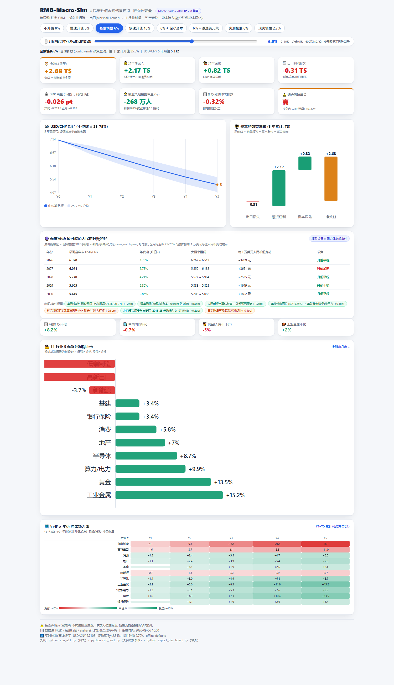

# RMB-Macro-Sim · 人民币升值宏观模拟 (v3.0)

> 🎯 **定位**:大国博弈下的财政·货币·产业一体化**宏观政策沙盒**(内核:国家资管·弱汇强币·产业升级·大国博弈)→ 回答:节奏怎么控 / 工具怎么选 / 极端扛不扛得住 / 谁疼谁赚。详见 [VISION.md](docs/VISION.md) ｜ 文件地图 [STRUCTURE.md](docs/STRUCTURE.md)

> 📖 中文文档 | **[English README → README_EN.md](README_EN.md)**
> ⚠️ 研究框架: 含规范性价值判断(卢氏三原则), 非客观预测, 不构成投资建议。

<p align="center">
  <a href="https://justinjchen-cornell.github.io/RMB-Macro-Sim/"></a>
  
  
  <a href="README_EN.md"></a>
</p>

<p align="center"><b>Macro scenario simulation: RMB appreciation → inflation / exports / industry profits / capital inflows → asset repricing.</b></p>

<p align="center"></p>

<p align="center"><a href="assets/system_map.png"></a></p>

> 🗺️ **先看图**:[体系架构图 + 易读版知识说明 → docs/体系图解与知识地图_2026-09.md](docs/体系图解与知识地图_2026-09.md)(五层架构: 数据 → 市场引擎 × 政策引擎 × 交叉验证 → 表达层;含"关键数字出处表"与常见误解澄清)

> ✨ **功能总览 (v3.0 · 政策模拟系统)**：
> - 🎚️ **升贬幅度滑块 -5% ~ +15%**(41 档预跑 MC,拖动实时联动行业/FX/瀑布/宏观风险)
> - 🏛️ **政策算法层(policy_engine.py, v3.0 一等公民)**:卢氏三原则统一系统(双口径去工业/分层通胀/S型资本/外储底线/四进口工具/最小政策度 k),与市场情景层并列
> - 🏛️ **GDP 当量 + 就业风险暴露 + 风险等级**逐档量化
> - 🗺️ **行业 × 年份热力图** · 🧭 **信号→动作对照表**(5 条阈值规则,联动 GOR)
> - 🔮 **年度展望三包络**(模型 × news_watch 新闻事件表,逐年 USD/CNY + 每万美元金额变动)
> - 📰 **日卡/结论卡自动生成**(social_cards.py,每日管道附带,4:5/1:1 可直接发圈)
> - 🔬 **回测校验层**(backtest.py):北向-汇率回归、9 段汇率窗口行业验证、平缓性诊断
>
> 🧭 This repository simulates the macro impact of a controlled RMB (CNY) appreciation path:
> FX (GBM, real-calibrated) → import inflation → export competitiveness (Marshall-Lerner) →
> 11-sector profit shocks → asset prices (A-shares / bonds / gold / commodities) +
> a **capital-inflow module** quantifying the net benefit of global dollar-scare capital
> migrating into RMB assets (financing + capital deepening vs. export losses).
>
> 🔍 Real-data layer (2026-09): USD/CNY from FRED + Tencent quotes, China exports (FRED),
> Northbound capital (akshare) — used to calibrate FX volatility/drift, equity inflow rates,
> export elasticity and industry FX betas. See `real_data_report_2026-09-06.md`.
>
> 📚 Headline result (6% annual appreciation, 5y): export loss **-0.31 T\$** vs financing
> **+2.17 T\$** + deepening **+0.82 T\$** → net **+2.68 T\$** (≈ 7-13× the cost (parameter interval, median ~9.7)).
>
> ⚠️ Research framework only — not investment advice. Sources: FRED, Tencent Finance,
> akshare (Eastmoney). Developed via collaborative AI-assisted research; data as of 2026-09.
> 研究框架,不构成投资建议。

---

# 宏观场景推演模型

> **人民币升值 → 通胀/出口/行业利润 → 资产价格重估**
> 一套基于 Monte Carlo 的可扩展宏观因子模拟框架
> (双语说明见上方 English block / full docs below in Chinese)

---

## 一、设计思想

整个模型围绕一条**传导链**展开：

```
汇率升值 ──→ 输入性通胀(PPI→CPI) ──→ 出口竞争力(Marshall-Lerner) ──→ 行业利润重估 ──→ 资产价格
```

每个环节都是可独立替换的"模块"，参数集中在 `config.yaml`，非技术人员也能调整假设。

---

## 二、算法架构

### 2.1 六大模块

| 模块 | 算法 | 输出 |
|------|------|------|
| **ExchangeRate** | 几何布朗运动 (GBM) + 升值漂移 | USD/CNY 路径 (n_sim × T) |
| **Inflation** | PPI传递 + CPI滞后方程 | CPI路径 |
| **Export** | Marshall-Lerner 弹性 | 出口量指数 |
| **IndustryProfit** | 汇率×敏感度 + 通胀成本 + 出口效应 + 利率效应 | 11行业利润冲击矩阵 |
| **AssetPrice** | 加权权益 + 久期模型 + 通胀弹性 | 股/债/金/商品收益 |
| **CapitalInflow** 🆕 | 存量放大 × 升值吸引力 × 美元荒时序 | 三渠道年流入 + 净效益瀑布 (见 §2.3) |

> **CapitalInflow (capital_inflow.py)** — 补齐"收益侧"：人民币主动升值 + 全球美元流动性稀缺
> → 人民币资产成为最优容器 → A股/债市/FDI 三渠道资本涌入 → 融资红利 + 资本深化。
> 成本-收益瀑布：**净效益 = 资本净流入 + 资本深化 + 出口利润损失(负)**。
> 2026-09 校准锚点 (6%年化升值, 5年累计)：出口损失 **-0.31 T$** ｜ 融资红利 **+2.17 T$** ｜
> 资本深化 **+0.82 T$** ｜ **净效益 +2.68 T$ ≈ 出口损失的 7-13 倍(参数区间)**。
> ⚠️ 参数为现实量级近似 + 校准假设（见 §5 待办）。

### 2.2 核心公式

**① 汇率路径 (GBM)**
$$dS_t = \mu S_t dt + \sigma S_t dW_t, \quad \mu = -\alpha_{apprec}$$

**② 通胀传导**
$$PPI_t = \phi \cdot \Delta(ImportPrice)$$
$$CPI_t = \lambda \cdot PPI_t + (1-\lambda) \cdot CPI_{t-1}$$

**③ 出口量 (Marshall-Lerner)**
$$\Delta Q_{export} = \epsilon_{price} \cdot \Delta E + g_{foreign}$$

**④ 行业利润**
$$\Delta\Pi_i = \beta^{fx}_i \cdot \Delta E + \beta^{cpi}_i \cdot CPI + \beta^{exp}_i \cdot \Delta Q_{export} + \beta^{r}_i \cdot \Delta r$$

**⑤ 资产定价**
- 权益: $E(R) = R_f + \sum w_i \cdot \Delta\Pi_i$
- 债券: $R_{bond} = y_{cn} - D \cdot \Delta y + coupon$
- 黄金: $R_{gold} = \alpha - 2 \cdot r_{real} + \beta \cdot \Delta E$
- 商品: $R_{comm} = \gamma + \delta \cdot CPI + \eta \cdot Demand_{CN}$

---

## 三、参数体系 (`config.yaml`)

关键参数（均可调）：

```yaml
exchange_rate:
  cny_annual_apprec: 0.06    # 年化升值6%
  cny_vol: 0.04

inflation:
  ppi_pass_through: 0.55      # 汇率→PPI 传递
  cpi_from_ppi: 0.30

fx_sensitivity:
  export_lowend: -2.80         # 低端出口最受伤
  commodity_metals: 1.50       # 资源品受益
  semiconductor: 0.60          # 进口成本下降
```

---

## 四、运行方式

```bash
# 0. 安装依赖
pip install numpy pandas matplotlib pyyaml requests
pip install fredapi akshare          # 可选: 真实数据源 (data_loader/run_real)

# 1. 一键全套 (config.yaml 参数 → 7 图 + 瀑布摘要)  ← 主入口
python run_all.py

# 2. 真实数据校准 (FRED/腾讯/北向 → 三情景 + 情景巨幕图)
python run_real.py --charts

# 3. 交互仪表盘 (单文件, 8 预设情景, 双击即用 / GitHub Pages)
python export_dashboard.py

# 4. 政策算法(卢氏三原则统一系统: 双口径/最小政策k/联合读数)
python policy_engine.py

# 5. 详细中文研报 (HTML + PDF, report/)
python build_report.py
python build_report_en.py     # English edition (RMB_Appreciation_Impact_Report_*.pdf)

# 5. 回测诊断 (北向-汇率回归 + 汇率窗口行业验证 + 平缓性分解)
python backtest.py

# 6. 社交媒体卡 (日卡 4:5 + 受益/受损/顺序 1:1 + 标题库)
python social_cards.py

# 7. 单元测试
python test_model.py      # 17 项 (引擎+资本+config)
python test_real_calib.py # 3 项 (校准函数, 离线)
```

输出目录：
```
macro_sim/
├── model.py            # 核心模型 (6大模块 + ScenarioEngine + config 装载)
├── capital_inflow.py   # 资本流入模块 (融资红利 + 资本深化)
├── data_loader.py      # 真实数据层: FRED + 腾讯行情 + akshare 北向 (缓存 data/raw/)
├── calibrate.py        # 实证校准: FX 波动/漂移 · 北向流入率 · 出口弹性 · 行业 β
├── visualize.py        # 图表 (浅色研报风, 跨平台中文字体)
├── config.yaml         # ★ 参数唯一真源 (被 run_all/run_real 读取)
├── run_all.py          # 一键: 多情景 + 图表 + 瀑布摘要
├── run_real.py         # 真实数据管线: 校准 → A/B/C 三情景
├── policy_engine.py    # ★ 政策算法统一引擎 (v3.0 canonical, 旧 policy_algo 已归档)
├── export_dashboard.py # 8 预设 + 21档滑块网格 + 宏观风险 + 展望 → dashboard.html
├── outlook.py / news_watch.yaml # 年度展望: 惯性漂移 + 新闻事件评分
├── build_report.py     # 中文研报 → report/*.html + *.pdf
├── test_model.py       # 17 项单元测试
├── test_real_calib.py  # 3 项校准离线测试
├── dashboard.html      # 交互仪表盘 (数据内嵌, 离线可用)  [Pages: index.html]
├── docs/               # code_review / superpowers spec
├── README_EN.md         # English edition
├── report/             # 研究报告 HTML + PDF (中文)
└── charts/             # 一键生成的图表 (浅色研报风)
    ├── 01_fx_scenarios.png        # 多情景汇率路径
    ├── 02_heatmap.png             # 行业利润热力图
    ├── 03_chain.png               # 传导链条
    ├── 04_capital_waterfall.png   # 净效益瀑布
    ├── 05_capital_inflows.png     # 三渠道年流入堆叠
    ├── 06_radar.png               # 资产收益雷达
    └── 07_sensitivity.png         # 敏感性矩阵
└── charts_real/        # 真实校准情景图
    ├── scenario_wall.png          # 🆕 三情景巨幕图 (A/B/C 一图对比)
    └── waterfall_B/C.png          # 实测参数瀑布
```

---

## 五、输出示例

### 5.1 汇率路径
- 基准情景 (6%/年): 5年后 USD/CNY 中位数 ≈ **5.38**
- 快速升值 (10%/年): 终值 ≈ **4.47**
- 慢速升值 (3%/年): 终值 ≈ **6.21**

### 5.2 行业利润冲击 (第5年, 6%升值情景, 2026-09 校准)

| 行业 | 利润冲击 | 方向 |
|------|----------|------|
| export_lowend (低端制造) | **-28.1%** | ↓ 最受伤 |
| export_hightech | -11.0% | ↓ |
| semiconductor | +8.7% | ↑ 受益 |
| commodity_metals | +15.2% | ↑ 购买力 |
| gold | +13.5% | ↑ |

### 5.3 资本流入净效益瀑布 (6%升值, 5年累计, T$)

| 项目 | 量级 | 含义 |
|------|------|------|
| 出口部门利润损失 | **-0.31** | 旧模型的"全部成本" |
| 资本净流入 (融资) | **+2.17** | 外资涌入 A股/债市/FDI |
| 资本深化 (GDP增量) | **+0.82** | 新增资本的长期生产率转化 |
| **▶ 净效益** | **+2.68** | **净收益 ≈ 损失的 7-13 倍(参数区间)** |

### 5.4 资产年化收益 (5年中位)

| 资产 | 年化收益 |
|------|----------|
| A股(加权) | +5~8% |
| 中国国债 | +1.7% |
| 黄金 | +8~12% |
| 工业金属 | +6~9% |

---

## 六、敏感性分析

| 情景 | 低端制造 | 半导体 | 金属/黄金 | A股加权 |
|------|----------|--------|-----------|---------|
| 快速(10%) | -14% | +6% | +12% | +5% |
| 基准(6%) | -8% | +4% | +8% | +3% |
| 慢速(3%) | -4% | +2% | +4% | +1% |
| 不升值 | 0% | 0% | 0% | 0% |

**关键洞察**：升值越快 → 行业分化越大 → **资源品/硬资产相对受益，低端出口相对受损**。

---

## 七、与宏观框架的衔接

这套算法的输出，直接对应咱们讨论的**一阶/二阶/三阶机会**：

| 模型输出 | 对应框架 |
|----------|----------|
| 黄金年化 +8~12% | 一阶：货币贬值对冲 |
| A股加权 +5~8% (含半导体/算力) | 二阶：中国核心资产 |
| 工业金属/资源 +6~9% | 三阶：关键矿产 |

**卢师语录的量化验证**：算法确认了"低端制造业受升值冲击最大（5年累计约 -28%）"的直觉判断，同时发现**半导体(+8.7%)、资源品(+13~15%)** 是升值的结构性受益者——这与"避免去工业化、保障贸易平衡"的政策取向一致。

---

## 八、真实数据接入 (2026-09 已完成)

三源接入 + 实证校准 + 三情景对比，报告见 `real_data_report_2026-09-06.md`：

```bash
python data_loader.py --refresh    # FRED + 腾讯(行情) + akshare(北向), 缓存 data/raw/
python run_real.py --charts        # 校准 → A/B/C 三情景 → charts_real/ 瀑布图
python test_real_calib.py          # 校准函数离线单测 (3/3)
```

**每日自动刷新管道**（`.github/workflows/daily-dashboard.yml`,每天 10:23 北京时间）:
`export_dashboard.py --live` 抓当日 FRED/腾讯数据 → 重校准即期/波动率/惯性 → 更新
dashboard.html → 自动提交 → Pages 自动重建。**需在仓库 Settings→Secrets 添加
`FRED_API_KEY`**（或 `gh secret set FRED_API_KEY --repo Justinjchen-Cornell/RMB-Macro-Sim`）;
无 key 时自动降级为离线缓存 + 腾讯现价刷新。

**实证结论速览**（详见报告）：
- 即期 USD/CNY = **6.71**（2026-09-05，模型基准 v2 已校准至 6.7108；v1 曾用 7.20）；近 1 年实际升值 **~6.2%/年** ≈ 模型情景 6%
- 波动率：5y 实测 4.0% ≈ 模型默认；3y 2.8% 更贴近近期
- 北向实证历史流入率 6.5%/年（2015-23），模型 11.1% 属"升值+美元荒"情景上限
- 出口总值对汇率弹性 33 年不显著（t=-0.6）→ 保留模型数量弹性 -0.45 并标注
- 行业 β：金属/黄金/银行"升值受益"、出口链"升值受损"方向获实证支持；**半导体反向**（国产替代期）
- 净效益对升值速度不敏感：2.7% 惯性情景仍 +2.63 T$（6% 情景 +2.68 T$）

## 九、扩展方向

- [x] **接入真实数据**：FRED + 腾讯行情 + 北向资金（2026-09，data_loader.py / calibrate.py）
- [ ] **贸易量(数量指数)数据**重估出口数量弹性（现用总值，含价格混响）
- [ ] **北向 2024-08 后黑暗期补盲**：季度港交所持股披露或 Wind 数据反推
- [ ] **加入政策反应函数**：央行干预、资本管制阈值
- [ ] **多国扩展**：USD/JPY、EUR/USD 联动
- [ ] **机器学习校准**：行业 β 从顾问级升级为自动写入（需利润面板数据）
- [ ] **Streamlit 交互界面**：滑块调节参数，实时出图

---


---

## 十、版本记录 · v2.1 (2026-09-06)

| 版本 | 内容 |
|---|---|
| v1.0 | 初版基线: 6 模块引擎 + config.yaml + 9 单测 |
| v2.0 | 资本流入模块(capital_inflow)+ 净效益瀑布; 真实数据层(data_loader/calibrate/run_real) |
| v2.1 打磨 | 浅色研报风; 情景巨幕图; config 真源化; dashboard v1; 中/英 PDF 报告; 每日管道(GitHub Actions); README_EN |
| v2.1 传播+实用 | 三包络展望 + 信号→动作表 + 日卡/结论卡 + 标题库; 滑块扩至 **-5%~15%**; 代码审查 8×P1 修复 |
| v2.1 回测修订 | backtest.py 诊断 → 修复 ±30% 截断/吸引力封顶/缺失 carry 通道; 流入率重锚(0.1088/0.0890/0.0475); 6% 头版不变; 档位区分度 ×3 |
| **v3.0 全面升级** | 政策系统去碎片化: policy_engine.py 统一 V2a/V2b/V3/V4(双口径并立、走资 v2 标定、报复博弈、外储底线);旧 policy_algo/v2/v3 归档;dashboard 政策卡切统一引擎;政策带 5-7%(6%: k=0.05, 政策16%/速度84%) |

**参数修订依据**: docs/backtest_2026-09.md ｜ **代码审查**: docs/code_review_2026-09-06.md ｜
**校准说明**: real_data_report_2026-09-06.md ｜ **spec**: docs/superpowers/specs/

---
> ⚠️ **免责声明**：本模型为教学/研究用途，参数基于公开信息估算，不构成投资建议。实际决策需结合专业判断。
